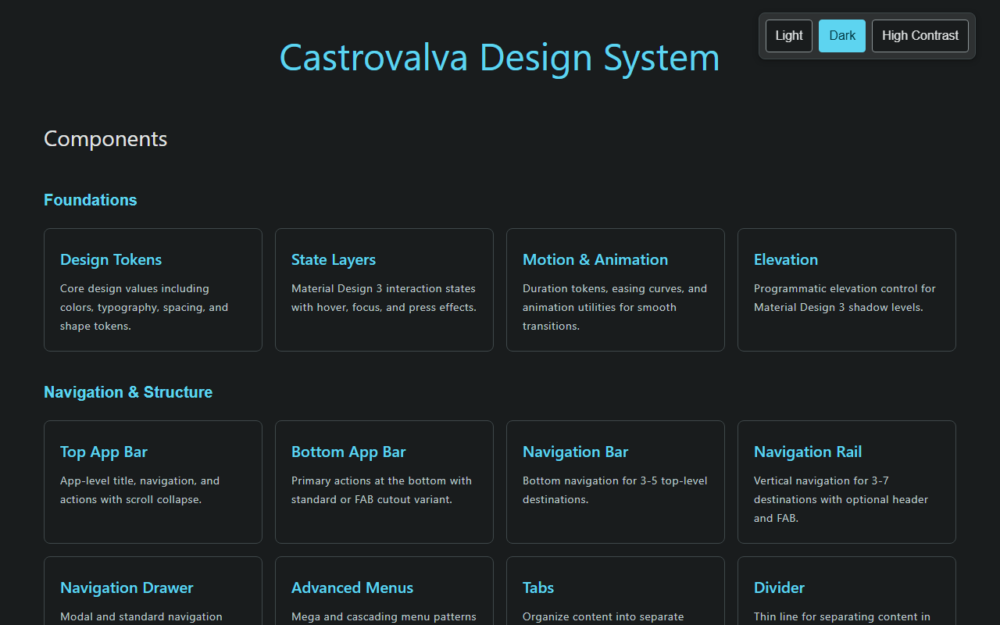

# Castrovalva Design System

[](https://github.com/carlosterly/castrovalva-css/actions/workflows/ci.yml)

Material Design 3 implemented as vanilla Web Components. Zero runtime
dependencies, Shadow DOM encapsulation, and a complete MD3 token system.

**43 components** · **2,114 tests** · **92% coverage** · **99 KB gzipped (full library)**

<sub>Measured, not estimated — see [Measured numbers](#measured-numbers) for the breakdown and how to reproduce each figure.</sub>

### → Live pattern library: **[carlosterly.github.io/castrovalva-css](https://carlosterly.github.io/castrovalva-css/)**

[](https://carlosterly.github.io/castrovalva-css/)

---

## Features

- **Material Design 3** — complete token system: semantic colour roles, type scale, motion, elevation, state layers
- **Zero dependencies** — pure vanilla JavaScript, no framework required
- **Standard Web Components** — Custom Elements v1 with Shadow DOM
- **250+ design tokens** — CSS custom properties throughout, themeable at runtime
- **2,500+ icons** — Material Symbols with variable font axes (weight, grade, fill, optical size)
- **Accessible** — targets WCAG 2.1 AA; full keyboard support and managed focus, and an automated axe pass over every docs page that CI blocks on (see [Accessibility](#accessibility) for what it doesn't cover)
- **Tree-shakeable for `button` and `icon`** — those two ship individual entry points; every other component currently comes in through the full bundle (see [Measured numbers](#measured-numbers))
- **Light, dark, high-contrast, and dynamic themes** — MD3 tonal palettes with persistence; the [theme playground](docs/components/theme-playground.html) generates a dynamic palette from any source colour
- **Cross-browser** — tested on Chromium, Firefox and WebKit

## Quick start

```bash
npm install                 # install dependencies
npx playwright install      # one-time: download test browsers
npm run dev                 # dev server on http://localhost:3000
```

The dev server opens the component index. Individual demo pages are at
`http://localhost:3000/docs/components/{name}.html` — for example
[`/docs/components/button.html`](docs/components/button.html). Demo pages import
from `src/` directly, so edits hot-reload without a build.

### Everyday commands

| Command | Does |
| --- | --- |
| `npm run dev` | Dev server with HMR, port 3000 |
| `npm test` | All tests, Chromium only |
| `npm test test/button.test.js` | One component — the fast dev loop |
| `npm run test:all` | All tests across Chromium, Firefox and WebKit |
| `npm run test:a11y` | Accessibility pass (axe + Playwright) |
| `npm run lint` | ESLint |
| `npm run check:docs` | Verify every CSS property, event and part the demo pages document exists in `src/` |
| `npm run build` | Production build to `dist/` |
| `npm run preview` | Serve the production build on port 8080 |

## Usage

```javascript
// Everything
import "castrovalva";

// Or individual components, for tree-shaking
import "castrovalva/button";
import "castrovalva/icon";
```

```html
<link rel="stylesheet" href="dist/css/styles.css" />

<ds-button variant="filled">Save</ds-button>
<ds-icon name="check"></ds-icon>
```

### Theming

Themes are driven entirely by CSS custom properties. Switch by setting
`data-theme` on the root element:

```javascript
document.documentElement.setAttribute("data-theme", "dark");
```

Token reference: [docs/tokens.md](docs/tokens.md) ·
[docs/motion.md](docs/motion.md) · [docs/state-layers.md](docs/state-layers.md)

## Project structure

```
src/
├── components/                   Web Components ({name}/{name}.js; some older ones flat)
├── tokens/palette.css            reference tonal palettes — the theme layer
├── tokens/tokens.css             role tokens, type, spacing, motion, shape
├── styles/                       reset, base, utilities
├── assets/icons/                 SVG sprite
└── index.js                      main entry
test/                             unit + accessibility tests
docs/
├── components/{name}.html        live component documentation
├── shared/                       pattern library CSS + theme init
└── ROADMAP.md                    direction and non-goals
index.html                        component index / playground
```

## Documentation

| Where | What |
| --- | --- |
| `docs/components/{name}.html` | Live, interactive documentation for every component — the authoritative API reference |
| [docs/examples/settings-page.html](docs/examples/settings-page.html) | A composed example — a realistic account-settings screen, not a component reference page. Proves navigation, forms, dialogs, and theming compose together, not just in isolation |
| [CLAUDE.md](CLAUDE.md) | Build conventions: component patterns, demo page rules, testing standards |
| [docs/ROADMAP.md](docs/ROADMAP.md) | Where the project is heading, and what it is deliberately not doing |

## Engineering notes

Short write-ups on specific decisions and what they actually cost, including
the parts that didn't go cleanly:

- [Why vanilla Web Components over a framework](docs/notes/why-vanilla-web-components.md)
- [The Shadow DOM and theming tension, and how it was resolved](docs/notes/shadow-dom-and-theming.md)
- [The form-association pattern](docs/notes/form-association-pattern.md)
- [What accessibility actually cost](docs/notes/accessibility-cost.md)

## Measured numbers

Republished periodically, not aspirational — reproduce any of these with the
command shown. Last measured 26 September 2026 (Lighthouse rows: 23 September).

| Metric | Result | Reproduce |
| --- | --- | --- |
| Unit tests | 2,114 passing, Chromium | `npm test` |
| Coverage | 92.2% statements | `npm test` (prints a summary; full report in `coverage/`) |
| Cross-browser | Chromium 2,114/2,114 · WebKit 2,047/2,048 · Firefox 2,036/2,048 (Firefox: 12 failing, all `ds-slider` pointer-drag simulation — tracked in [DEFECTS.md](docs/DEFECTS.md), not yet confirmed as a real Firefox bug vs. a test-harness quirk; WebKit: 1–2 intermittent `ds-search` arrow-key test failures that predate this measurement, also tracked there) | `npm run test:all` |
| Bundle — full library | 609 KB raw / 99 KB gzip (`dist/index.js`, all 43 components + icons) | `npm run build` |
| Bundle — `castrovalva/button` | 16.8 KB raw / 3.2 KB gzip | `npm run build` |
| Bundle — `castrovalva/icon` | 6.6 KB raw / 2.0 KB gzip | `npm run build` |
| Lighthouse, home page — mobile (simulated throttling, Lighthouse default) | Performance 98 · Accessibility 100 · Best Practices 100 · SEO 100 | `npx lighthouse https://carlosterly.github.io/castrovalva-css/` |
| Lighthouse, home page — desktop | Performance 100 · Accessibility 100 · Best Practices 100 · SEO 100 | `npx lighthouse https://carlosterly.github.io/castrovalva-css/ --preset=desktop` |
| Lighthouse, a component page (`button.html`) — mobile | Performance 69 · Accessibility 98 · Best Practices 100 · SEO 90 | `npx lighthouse https://carlosterly.github.io/castrovalva-css/docs/components/button.html` |

Three things this table intentionally doesn't smooth over:

- Only `button` and `icon` currently have individual build entries
  (`vite.config.js`) and matching `package.json` exports. Every other
  component ships through the full bundle only — the "tree-shakeable" claim
  is accurate for two components out of 43, not all of them.
- The home page's Lighthouse accessibility score was 92 when this table was
  first published, tracing to the same `aria-progressbar-name` /
  `aria-toggle-field-name` bugs the [accessibility harness](test/accessibility/)
  had found independently. Fixing those for the harness took the Lighthouse
  score to 100 too — two tools agreeing on the problem, then on the fix.
- Lighthouse performance on simulated mobile varies a lot between runs (the
  home page scored 71 on the first published run, 98 on the latest). Treat
  any single figure as a sample, not a constant.

## Browser support

Chrome/Edge 90+ · Firefox 88+ · Safari 14+ · Opera 76+

Requires Custom Elements v1 and Shadow DOM v1. Backed by the cross-browser
unit-test run in [Measured numbers](#measured-numbers) — Chromium is fully green;
WebKit has an intermittent `ds-search` test failure and Firefox 12 known
failures, both under investigation.

## Accessibility

Every component targets WCAG 2.1 AA: semantic HTML, correct ARIA roles and
labels, full keyboard navigation, managed focus with visible indicators, screen
reader announcements, and disabled states that genuinely prevent interaction.
An automated axe pass (`npm run test:a11y`, added September 2026) covers all
51 demo pages plus the home page and the composed example, in light and dark
theme. Its first run found 45 of 102 checks failing — real ARIA/contrast bugs,
not false positives. All of them are now fixed: 106/106 checks pass, and CI
blocks on any regression. See [what building that harness actually
found](docs/notes/accessibility-cost.md) for the longer version.

Automated checks aren't the whole story: axe doesn't yet run against the
high-contrast theme, and it can't judge interaction patterns — for example,
the navigation bar and rail announce `role="tab"` without the arrow-key
behaviour that role implies. Known gaps like these are tracked in
[DEFECTS.md](docs/DEFECTS.md).

Verify with `npm run test:a11y`.

## Contributing

See [CLAUDE.md](CLAUDE.md) for component patterns, demo page requirements and
testing standards. In short: three deliverables per component (source, tests,
demo page), `npm run lint` must exit 0, and `npm test` must pass.

## License

MIT © Carl Osterly

Material Design 3 is a design system by Google. This is an independent
implementation and is not affiliated with or endorsed by Google.
